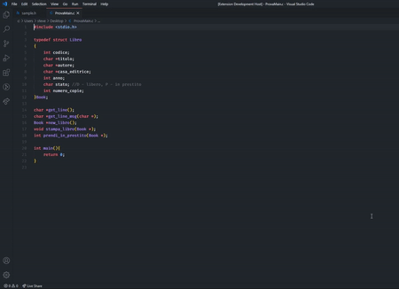

# Autocomplete C/C++ files

This extension will write the implementation of your C/C++ code without make you copy and paste like an idiot.

## Features

the extension will generate the implementation file, if you run the command "write implementation file", or will generate the implementation for the functions at the end of the file, if you run the command "Parse main file" comments are skipped.

## Usage
Open the command Palette (`ctrl + shift + P`) and select one of the following commands:

* `Wirte Implementation File` also accesibile via `ctrl + shift + J`
* `Parse Main File` also accesibile via `ctrl + shift + L`

### Write implementation file:

with a normal C header file


with a C++ header file that contains a class


> The command will read the header file and will print in a file that will prompt side by side the header file in the editor (see the column number setting in the settings menu).

### Parse main file:

whith the main file


> The command will read the focused file in the editor and will append the methods signatures at the end of the file.

## Extension Settings

this extension can be custimizabile with some settings

For example:

* `autocomplete-c-cpp-files.indentStyle`: choose the indentation style between K&R (default) and Allman click [here](https://en.wikipedia.org/wiki/Indentation_style#Brace_placement_in_compound_statements) for more information
* `autocomplete-c-cpp-files.columnNumber`: choose the column to open the implementation file, default is 2 (will open the file side by side the header file in the editor) 

## Known Issues

here is a list of all the known issues I am working on, if you find a new issue please report it [here](https://github.com/SteveSevetS/autocomplete-c-cpp-files/issues).

* Comment Issue: If there is a line that ends with ); in a comment block but the lines in the block doesen't start with a * the parser will include that line in the implementation too.

> Tip: For now I reccomend you use the standard comment block wich have a * at the start of every line.
```C
/**
  * use this type of comment block
  */
``` 

* Class Issue: If there is a file wich contains some functions not related to any class and a class, the parser will think that all the functions are class members.


## Release Notes

### 1.0.0

Initial release of the extension!!!

-----------------------------------------------------------------------------------------------------------