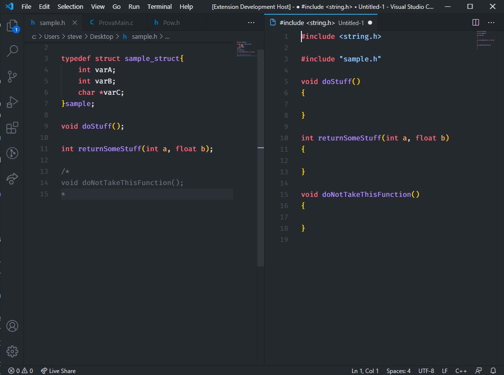

# Autocomplete C/C++ files

This extension will write the implementation of your C/C++ code without make you copy and paste like an idiot

## Features

the extension will generate the implementation file, if you run the command "write implementation file", or will generate the implementation for the functions at the end of the file, if you run the command "Parse main file"

### Write implementation file:
with a normal C header file

with a C++ header file that contains a class

> The command will read the header file and will print in a file that will prompt side by side the header file in the editor.

### Parse main file:

> The command will read the focused file in the editor and will append the methods signatures at the end of the file.

## commands

* Wirite implementation file
* Parse main file

## Extension Settings

Include if your extension adds any VS Code settings through the `contributes.configuration` extension point.

For example:

This extension contributes the following settings:

* `myExtension.enable`: enable/disable this extension
* `myExtension.thing`: set to `blah` to do something

## Known Issues

Calling out known issues can help limit users opening duplicate issues against your extension.

## Release Notes

### 1.0.0

Initial release of the extension!!!

-----------------------------------------------------------------------------------------------------------

## Known Issues

here is a list of all the known issues I am working on, if you find a new issue please report it [here](https://github.com/SteveSevetS/autocomplete-c-cpp-files/issues)

* if a line is a method signature but it is in a comment block and doesen't start with /* or * or // the extension will treat that line as a method signature

* if there is a class in the file the extension will implements the functions with ClassName::FunctionNAme with all of them
